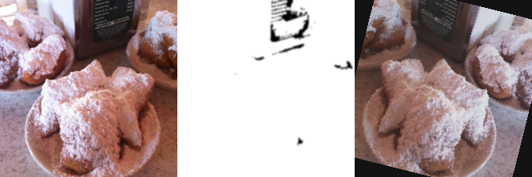

# Image Preprocessing for Food101

## Overview
> Hugging Face 'ethz/food101' 데이터셋에서 이미지를 가져와 
AI 학습 전처리를 수행하는 파이프라인을 구현합니다.  

- **기본 전처리**:  
  1. Resize (224×224)  
  2. Grayscale & Normalize (0–1)  
  3. Noise Remove (Gaussian Blur)  
  4. Data Augmentation (Flip, Rotation, Color Jitter)  

<br>

- **심화 필터링**:  
  - 너무 어두운 이미지 제거 (평균 밝기 기준 ('BRIGHTNESS_THRESHOLD=0.1'))  
  - 객체 크기가 너무 작은 이미지 제거 (밝은 픽셀 면적 비율 기준 ('AREA_RATIO_THRESHOLD=0.05'))  

## Pipeline Details
1. Resize -> Grayscale -> Normalize
    ```python
    img = pil_img.resize((224,224))
    gray = img.convert("L")
    arr  = np.array(gray, dtype=np.float32) / 255.0
    ```

2. Dark Image Filter
    ```python
    if arr.mean() < BRIGHTNESS_THRESHOLD: return None
    ```

3. Small Object Filter
    ```python
    _, mask = cv2.threshold((arr*255).astype(np.uint8), 
                           int(BRIGHTNESS_THRESHOLD*255),
                           255,
                           cv2.THRESH_BINARY)
    if (mask>0).sum()/mask.size < AREA_RATIO_THRESHOLD: return None
    ```

4. Gaussian Blur
    ```python
    blurred = cv2.GaussianBlur(mask, (5,5), 0)
    ```
   
5. Data Augmentation
- RandomHorizontalFlip
- RandomRotation(15°)
- ColorJitter(brightness=0.2, contrast=0.2, saturation=0.2)

## Results

> Original | Blurred Gray | Augmented Color


<br> **combiend_01.png - 샘플 1 결과**


<br> **combiend_03.png - 샘플 3 결과**

## Project Structure
```text
.
├── image_preprocessing.py
├── preprocessed_samples/
│   ├── combined_00.png
│   └── …
└── README.md
```

 
## How to Run
- 가상환경 활성화  
- 필요 패키지:  
  ```bash
  pip install datasets pillow numpy opencv-python torchvision
  ```
- 스크립트 실행
    ```python
    python image_preprocessing.py
    ```
   