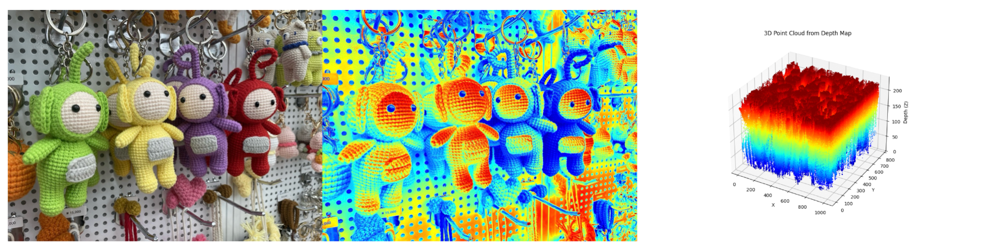

# Depth Map 기반 3D Point Cloud 생성

---

## Overview

- **목표**  
  OpenCV만으로  
  1) 단일 이미지 -> 가짜 Depth Map 생성  
  2) Depth Map -> 3D Point Cloud 변환 및 시각화 
  

- **언어/라이브러리**: Python, OpenCV, NumPy, Matplotlib, Pytest  


## Project Structure
```text
project02/
├── image_utils.py          # 이미지 로드 / 예외 처리, BGR -> HSV 변환 유틸
├── depth_map.py            # Grayscale -> ColorMap Depth Map 생성 + 화면 / 파일 출력
├── point_cloud.py          # Depth Map -> (x,y,z) 포인트 클라우드 생성 / 3D 시각화
├── test_image_utils.py     # load_image(), cvt_to_hsv() 유닛 테스트
├── test_3d_processing.py   # generate_depth_map() 정상 / 예외 테스트
└── image.jpeg              # 샘플 입력 이미지
```

## Pipeline Details
1. **Setup & Install**
  ```bash
    pip install numpy opencv-python pytest matplotlib
  ```

2. **Image Utilities - image_utils.py**
  - 이미지 불러오기, BGR -> HSV 변환

3. **Depth Map - depth_map.py**
  - Grayscale -> JET Colormap

4. **Point Cloud - point_cloud.py**
  - Depth Map 픽셀별 (x, y, z) 점 생성

5. **Unit Tests**
  - test_image_utils.py: utils 테스트
  - test_3d_processing.py: Depth Map 핵심 기능 테스트

## How to Run
1) Depth Map 생성
```commandline
    python depth_map.py
```

2) Point Cloud 생성
```commandline
   python point_cloud.py
```

3) 테스트 진행
```commandline
  pytest test_image_utils.py
  pytest test_3d_processing.py
```

## Results
> Original | Depth Map | 3D Point Cloud



### 
> 원본 이미지의 인형 형태의 3D Point Cloud가 아닌 정육면체 블록 형태의 결과가 나온 이유

1. 진짜 Depth가 아닌 '픽셀 밝기' 기반
   - Depth Map을 위해서 grayscale로 변환한 밝기값(gray)을 곧바로 z축 값으로 사용하였습니다. <br>
   
   ➡️ 픽셀마다 동일한 X, Y 격자 위에, Z만 색상 강도에 따라 칠해진 점들입니다.
  
2. 형태 정보 없이 컬러맵만 사용
   - 객체 윤곽/표면 구조를 복원하려면 Lidar, Stereo, MiDaS/DPT 같은 **실제 거리 추정** 기법이 필요합니다. <br>
   
   ➡️ 'cv2.applyColorMap()' 은 “보기 좋게 색칠”만 할 뿐, 형태를 재구성 할 수 없습니다.

