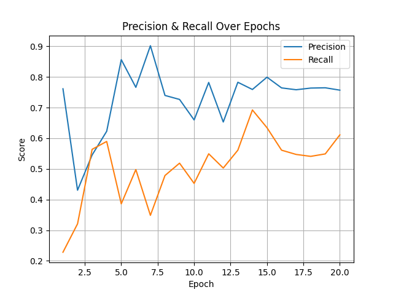
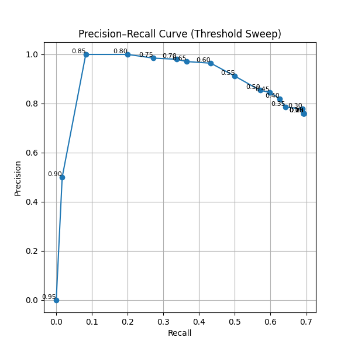
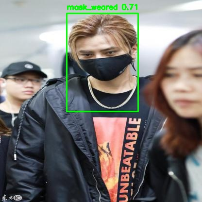
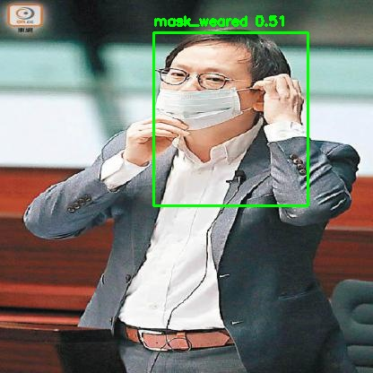
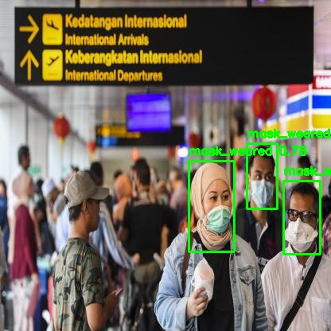
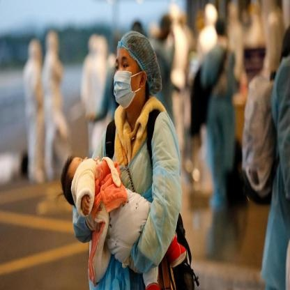
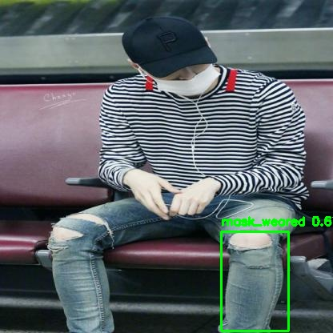
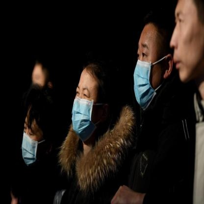

# Mask Detector (YOLOv8)

----

## Overview
### data
https://universe.roboflow.com/mask-detection/mask-detection-ysu3e
> - 사람 얼굴에서 마스크 착용 여부 (mask_weared, no_mask)를 탐지하는 객체 탐지 모델
> - **YOLOv8s** 백본 + 정적 데이터 증강으로 성능 개선
> - 운영 목적상 오탐 최소화에 가중치를 두어 운영 임계치(conf)=0.50 설정

### 최종 성능
#### Validation (conf=0.50, IoU=0.45)
- Overall: P 0.759 / R 0.692 / mAP50 0.760 / mAP50–95 0.456
- mask_weared: P 0.817 / R 0.785 / mAP50 0.845
- no_mask: P 0.700 / R 0.600 / mAP50 0.674

#### Test (conf=0.50, IoU=0.45)
- Overall: P 0.861 / R 0.562 / mAP50 0.710 / mAP50–95 0.504
- mask_weared: P 0.971 / R 0.791 / mAP50 0.892
- no_mask: P 0.750 / R 0.333 / mAP50 0.529

---

## Pipeline Details
### Data
- `config/data.yaml`
    ```yaml
    train:
        - ../datasets/train/images
        - ../datasets/train/images_aug   # 원본 + 증강 함께 학습
    val:  ../datasets/valid/images
    test: ../datasets/test/images

    nc: 2
    names: ['mask_weared', 'no_mask']
    ```

### Training
- 백본: YOLOv8s (COCO pretrained)
- Main Parameter:
  - `epochs=20`, `batch=8`, `optimizer=AdamW`, `lr0=1e-3`
  - 검증 NMS IoU: `ìou=0.45`
  - `cache="disk"`, `workers=4`, `device="mps"`(Apple Silicon)
- 산출물:
  - `weights/mask_detector_v2/weights/best.pt`
  - 학습 로그: `weights/mask_detector_v2/results.csv`

### Evaluation
- `eval_plot.py`:
  1. **모델 검증** (val data, 공통 세팅 적용)
  2. **학습 곡선**: Precision/Recall vs Epoch
     `results/graphs/performance_curve.png`
  3. **Threshold Sweep**: conf ∈ {0.05, 0.10, …, 0.90} -> PR 곡선
     `results/graphs/pr_curve_threshold_sweep.png`

---

## How to Run
### environments
```bash
  pip install -U ultralytics==8.3.174 albumentations opencv-python matplotlib pandas
```
- Apple Silicon(M1/M2/M3): torch는 conda 환경에서 설치 권장. mps 자동 사용.

### Train (증강 + YOLOv8s)
```bash
  python src/train.py
```
- weights: `weights/mask_detector_v2/weights/best.pt`

### 평가/그래프 생성
```bash
  python src/eval_plot.py
```
- 출력:
  - `results/graphs/performance_curve.png`
  - `results/graphs/pr_curve_threshold_sweep.png`

### Test 결과
```bash
  python src/run_inference.py
```
- 결과: `results/final_predictions/*.jpg`

---

## Results
### Validaion (conf=0.50, iou=45)
- Overall: P 0.759 / R 0.692 / mAP50 0.760 / mAP50–95 0.456
- Class:
  - mask_weared: P 0.817 / R 0.785 / mAP50 0.845
  - no_mask: P 0.700 / R 0.600 / mAP50 0.674

### Test (conf=0.50, iou=0.45)
- Overall: P 0.861 / R 0.562 / mAP50 0.710 / mAP50–95 0.504
- Class:
  - mask_weared: P 0.971 / R 0.791 / mAP50 0.892
  - no_mask: P 0.750 / R 0.333 / mAP50 0.529

### Plots
#### 학습 곡선

`results/graphs/performance_curve.png` 

<br>

#### Threshold Sweep

`results/graphs/pr_curve_threshold_sweep.png`

### Sample Predictions
- Folder: `results/final_predictions/`

**성공**

|  | |  |
|--|--|--|
**실패**

|  | |  |
|--|--|--|

#### Failure cases & Notes
- `no_mask` Recall이 비교적 낮음 -> 클래스 불균형 영향
- 작은 얼굴/각도/부분 가림 상황에서 미탐 발생으로 추측


---

## 시행착오
1. 공통 설정 (`src/config.py`)
    - 경로/하이퍼파라미터 분산으로 인한 혼선 방지
    - `MODEL_FILE`, `RESULTS_CSV`, 임계치, 이미지 크기 등


2. 증강 데이터 사용 방식
    - 처음엔 증강만 학습하는 것으로 이해 -> 원본 + 증강을 함께 학습해야 일반화 up
    - `data.yaml`의 `train`에 `images`와 `images_aug` 둘 다 포함


3. 라벨 무결성 이슈
    - 초기에 `0.0` 같은 float 클래스, OOB/빈 라벨, 너무 작은 박스가 있어 성능 흔들림
      - 해결:
        - 클래스 정수화(`int(float(cls))`)
        - 박스 클리핑, `min_visibility=0.20`
        - 아주 작은 박스 제거(0.16% 미만)
        - 유효 박스 없으면 아예 저장 스킵 → 깨끗한 aug 세트 확보


4. 백본 교체: v8n → v8s
    - v8n으로는 리콜/안정성이 부족함을 확인
    - v8s로 교체 후 유의미한 개선 관찰

    
5. 임계치 선택 기준
    - Threshold Sweep상 F1 최댓값은 낮은 conf에서 발생했지만, 오탐 줄이기를 고려해
    - `conf=0.50` 채택(Precision↑, Recall은 적당 수준)


6. 학습 디렉토리 혼선
    - 재현성 위해 resume=False(완전 재학습) 원칙, 필요 시 명시적 체크포인트 지정


7. 성능 변동 이슈(NMS time limit 경고, 리콜 출렁)
    - Mac/MPS + CPU 혼용에서 발생하는 로그 지연성 영향. 성능값은 최종 에폭/검증에서 보고.
    - `cache="disk"`, `workers=4`로 IO 병목 완화.

---

## 한계
- 데이터 불균형: `no_mask` 샘플이 적어 리콜이 낮은 것으로 추측 <br>
- 라벨: 일부 작은/애매한 박스는 모델에 노이즈

---

## Project Structure
```text
project03/
├─ config/
│  └─ data.yaml                     # train/valid/test 경로 및 클래스 정의
├─ datasets/
│  ├─ train/{images, labels}
│  ├─ train_aug/{images, labels}
│  ├─ valid/{images, labels}
│  └─ test/{images, labels}
├─ results/
│  ├─ graphs/                       # evaluate
│  └─ final_predictions/            # 최종 test 결과
├─ src/
│  ├─ config.py                     # 공통 경로/하이퍼파라미터 집합
│  ├─ train.py                      # 증강 + 학습(YOLOv8s)
│  ├─ eval_plot.py                  # 검증, PR 곡선/학습곡선 생성
│  ├─ run_inference.py              # 테스트/샘플 이미지 추론 저장
│  ├─ yolov8s.pt                    # 백본 가중치(사전학습)
│  └─ weights/
│     └─ mask_detector_v2/
│        └─ weights/{best.pt}
└─ README.md
```

